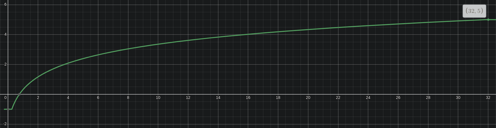

### Pride
- pride is based off of army size
- You want a strong army for war, not happiness
- however a strong military will bring pride and thus some happiness
- so there is a limit on how much happiness pride can bring
- additionally, pride cannot decrease happiness too much, so there is a lower limit
```go
lowerlimit := -1    // min happiness from pride
upperlimit := 5     // max happiness from pride
modifier := 0.25    // modifier
equation := max(
	min( log2(armySize + modifier), upperlimit),
	lowerlimit 
	)
```
- given an army size of _, we get a pride val of _ 
  - 0: -1
  - 1: 0.25
  - 2: 1.17
  - 3: 1.7
  - 4: 2.087
  - 5: 2.392
  - ...
  - 10: 3.358
  - 15: 3.931
  - 20: 4.34
  - 25: 4.658
  - 30: 4.919
  - 32: 5
#### Graph


### Resource Excess
- excess of resources(food and wood) affect happiness
- excess = (Production - Costs)
- It's good to have excess, but at some point, you wanna start exporting it
- thus, there is a upper limit
- also, to keep numbers in check, there is a limiter
```go
Production int
Cost int
upperlimit := 10
limiter := 5
equation := min(
    (Production - Cost) / limiter,
	upperlimit
	)
```